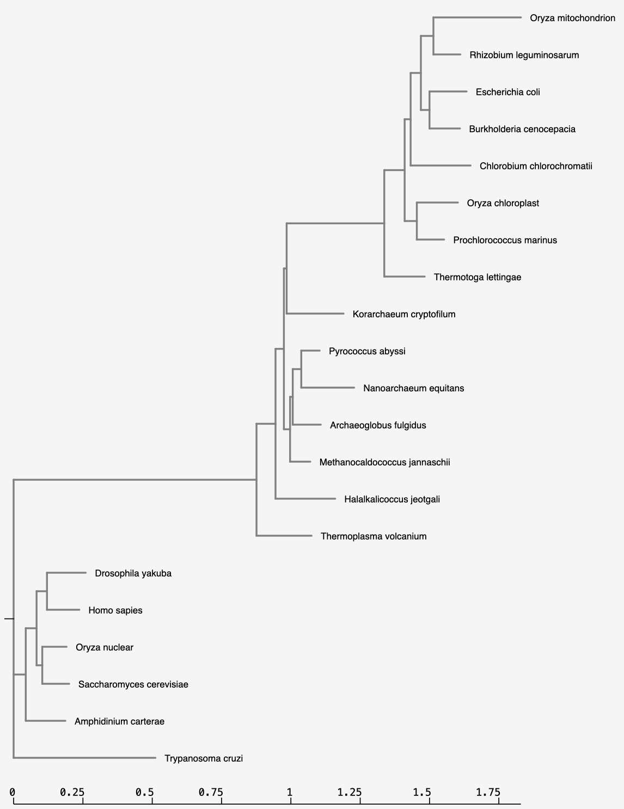

```{r setup, include=FALSE}
knitr::opts_chunk$set(echo = TRUE)
```


# NGPhylogeny.fr
###1.Takes in multiple sequences to evaluate
###2.Align these sequences so that distance is calculated between said sequences
###3.Determine the relationship between the sequences
###4.Finally, visualize these relationships


```{r, eval=FALSE}
BiocManager::install("ggtree")
```


```{r}
library(tidyverse)
# added treeio and ggimage library
# need to install libmagick 
#sudo apt-get install libmagick++-dev
```

